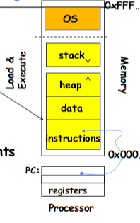
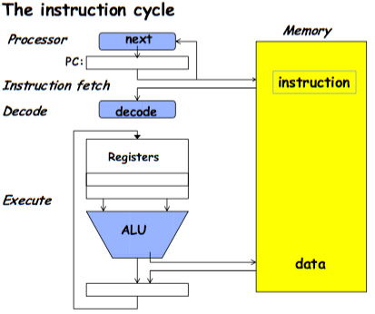
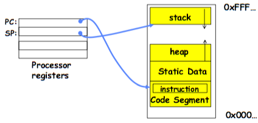
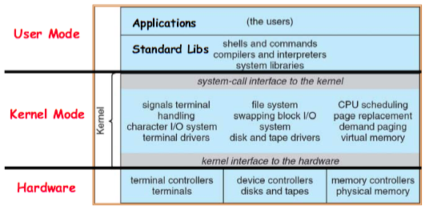
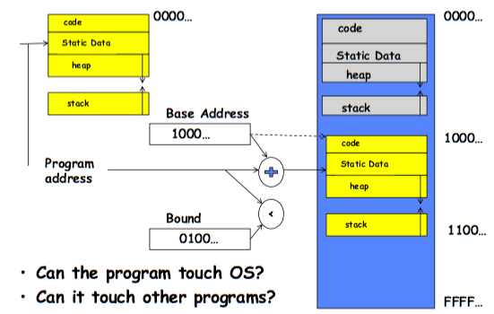
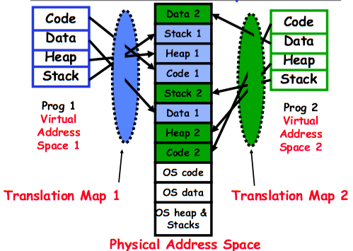

# 01.OS Concept

## Process

### Introdution

**Fundamental OS Concepts**

- Thread
	- Single unique execution context
	- Program Counter, Register, Execution Flags, Stack
- Address Space with Translation
	- Program execute in an **address space** that is distinct from the memory space of the physical machine
- Process
	- An instance of an executing program is a **process** consisting of **an address space** and **one or more threads of control**
- Dual Mode Operation/Protection
	- Only the **system** has the ability to access certain resources
	- The OS and the hardware are protected from user program.
	- User programs are isolated from one another by **controlling the translation** from program virtual address to machine physical address.

**OS Bottom Line: Run Programs**

- 
-  Load instruction and data segments of executable file into memory
-  Create stack and heap
-  Transfer control to it
-  Provide services to it
-  While protecting OS and it

**Execution Sequence**

- 
- Fetch Instruction at PC
- Decode
- Execute
- Write Back to Register/Mem
- PC = Next Instruction(PC)
- Repeat

### First: Thread of Control

- Thread: Single unique execution context
	- PC, Register, Execution Flags, Stack
- A thread is executing on a processor when it's resident in the processor registers.
- PC register holds the address of executing instruction in the thread.
- Registers hold the **context** of thread
	- Stack Pointer, Frame Pointer, Heap Pointer, Data

### Second: Address Space

**Address Space**

- 
- Address space: the set of accessible addresses + state associated with them
	- For a 32-bit processor there are $2^{32} = 4*10^9$ addresses
-  When you read or write to an address
	-  Nothing
	-  Acts like regular memory
	-  Ignores writes
	-  Causes I/O operation (Memory-mapped I/O)
	-  Causes exception (fault)
- Use a single processor to simulate multiple processors (multiplex)
	- Every virtual CPU needs to hold pc, sp, and reg.
	- Save/Load PC, SP, and Reg
	- Timer, voluntary yield, I/O and other things trigger switch.

**Concurrency**

- The basic problem of concurrency involves resources
	- Hardware: single CPU, single DRAM, single I/O devices
	- Multiprogramming API: processes think they have exclusive access to shared resources
- OS has to coordinate all activity
	- Multiple processes, I/O interrupts, ...
- Basic Idea: Use Virtual Machine abstraction
	- Simple machine abstraction for processes
	- Multiplex these abstract machines

**Simple Multiprogramming Technique**

- All virtual CPUs share same non-CPU resources
	- I/O devices the same
	- Memory the same
- Consequence of sharing
	-  Each thread can access the data of every other thread (good for sharing, bad for protection)
	-  Threads can share instructions (good for sharing, bad for protection)

**Protection**

- Operating System must protect itself from user programs
	- Reliability: compromising the operating system generally causes it to crash
	- Security: limit the scope of what processes can do
	- Privacy: limit each process to the data it is permitted to access
	- Fairness: each should be limited to its appropriate share of system resources (CPU time, memory, I/O, etc)
- It must protect User programs from one another
- Primary Mechanism: limit the translation from program address to physical memory space
- Additional Mechanisms
	- Privilege instructions, in/out instructions, special register
	- syscall processing, subsystem implementation

### Third: Process

- Process: execution environment with Restricted Rights
	- Address Space with One or More Threads
	- Owns memory (address space)
	- Owns file descriptors, file system context, ...
	- Encapsulate one or more threads sharing process resources
- Why processes?
	- Protected from each other.
	- OS Protected from them
	- Processes provides memory protection
	- Threads more efficient than processes

### Fourth: Dual Mode Operation

- Hardware provides at least two modes
	- Kernel Mode
	- User Mode
- We need something to support dual mode
	- a bit of state (user/system mode bit)
	- Certain operations / actions only permitted in system/kernel mode
	- User->Kernel transition: sets system mode AND saves the user PC
	- Kernel->User transition: clears system mode AND restores appropriate user PC
- 
- Simple Protection: Base and Bound
	- 
- Types of Mode Transfer
	- Syscall
	- Interrupt
	- Trap or Exception
- Use Interrupt Vector to get the system target address of the **unprogrammed control transfer**.
	- Process A runs
	- Interrupt
	- Switch User Process
	- Resume Procee B State
- Virtual Address Translation
	- 
- Process Control Block
	- Contain
		- Status (running, ready, blocked, ...)
		- Register state (when not ready)
		- Process ID (PID), User, Executable, Priority, ...
		- Execution time, ...
		- Memory space, translation, ...
	- Kernel Scheduler maintains a data structure containing the PCBs
	- Scheduling algorithm selects the next one to run
- Implementing Safe Mode Transfer
	- Carefully constructed kernel code packs up the user process state an sets it aside.
	- Should be impossible for buggy or malicious user program to cause the kernel to corrupt itself.
	- Interrupt processing not be visible to the user process
		- Occurs between instructions, restarted transparently
		- No change to process state
- Kernel Stack Chanllenge
	- Kernel needs space to work
	- To avoid the hacking, cannot put anything on the user stack
	- Two-stack model
		- OS thread has interrupt stack (located in kernel memory) plus User stack (located in user memory)
		- Syscall handler copies user args to kernel space before invoking specific function (e.g., open)
		- 
- Hardware support: Interrupt Control
	- Interrupt Handler invoked with interrupts **disabled**
		- Re-enabled upon completion
		- Non-blocking (run to completion, no waits)
		- Pack it up in a queue and pass off to an OS thread to do the hard work
	- OS kernel may enable/disable interrupts
	- HW may have multiple levels of interrupt
- How do we take interrupts safely?
	- Interrupt vector
		- Limited number of entry points into kernel
	- Kernel interrupt stack
		- Handler works regardless of state of user code
	- Interrupt masking
		- Handler is non-blocking
	- Atomic transfer of control
	- Transparent restartable execution
- Kernel System Call Handler
	- Locate arguments
	- Copy arguments
	- Validate arguments
	- Copy results back

## I/O

## Networks and VM